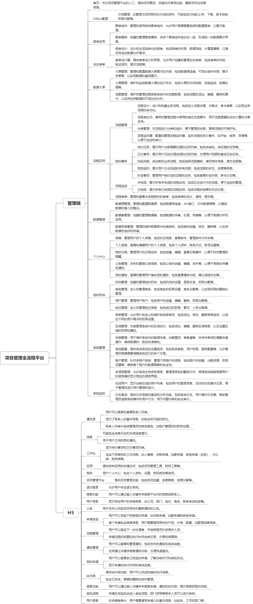

 

    
 

公司拥有上百套具有自主知识产权的软件系统，详情请查看码云首页或公司官网

 
<h1>项目管理系统</h1>

<a href="https://www.haishi.net.cn/">公司官网</a> ｜ <a href="https://www.haishi.net.cn/">在线体验</a>

 

## 系统介绍

工厂项目管理系统
本项目名称为项目管理系统，是一款面向企业内部的项目管理软件。该系统涵盖了从项目立项、合同签订、项目实施、费用报销到项目验收等全过程管理，旨在帮助企业规范项目管理流程，提高项目运作效率，降低项目成本，提升企业核心竞争力。
本项目主要包括以下功能模块：
- 系统管理：包括用户管理、部门管理、角色管理、菜单管理、数据字典、编号模式、定时任务管理等功能，用于维护系统的基础数据和权限配置。
- 基本档案：包括客户档案、职务档案、项目立项档案、里程碑档案、客商分类档案、信息来源档案、商务关系档案、客商分组档案、休眠类型档案、单位规模档案、客户关系档案、价值级别档案、客商行业档案、销售状态档案、人员规模档案、注册资金档案、物料档案等，用于管理项目相关的基础数据。
- 合同管理：包括合同档案管理，用于管理项目相关的合同信息。
- 项目管理：包括项目档案管理，用于管理项目的进度、成本、质量、风险等信息。
- 项目工作：包括实施日志、开发日志、服务日志、实施里程碑确认单、开发里程碑确认单、服务里程碑确认单、产品确认单等，用于记录项目实施过程中的各项工作内容。
- 发票管理：包括采购发票和销售发票管理，用于管理项目相关的发票信息。
- 收付款管理：包括收款单、付款单、财务收款确认等，用于管理项目相关的收付款信息。
- 费用报销：包括费用报销单管理，用于管理项目相关的费用报销信息。
- 报表：包括项目成本核算表、项目情况统计表等，用于统计和分析项目数据。
- 系统监控：包括日志管理和我的消息，用于监控系统运行状态和查看系统消息。
本项目从用户层面可以分为一个端：
- 管理端：公司内部管理员用户使用，可以进行基础数据维护、项目管理、合同管理、费用报销等所有操作。
                

## 系统功能介绍

### 系统包含终端说明

管理端（WEB）

| 序号 | 模块 | 模块说明 |
| --- | --- | --- |
| 1 | GC-PMS-CD-SERVER | 服务端 |
| 2 | GC-PMS-CD-MANAGE | 管理端 |

### 系统功能结构

### 系统功能说明

- 项目管理：该系统提供全面的项目管理功能，涵盖了项目立项、进度跟踪、任务分配、风险控制等方面，帮助企业有效地管理项目。
- 合同管理：系统支持合同签订、执行、变更等全流程管理，并与项目管理模块紧密结合，方便企业实时掌握项目合同执行情况。
- 费用报销：该系统提供便捷的费用报销功能，员工可以线上提交报销申请，管理人员可以线上审批，提高了报销效率，方便了费用管理。
- 报表分析：系统提供多种报表分析功能，可以对项目成本、进度、质量等进行多维度分析，帮助企业及时发现问题，做出决策。

## 系统主要界面

## 系统技术说明

### 代码模块说明

| 序号 | 目录 | 目录说明 |
| --- | --- | --- |
| 1 | GC-PMS-CD-SERVER/src | -- |

### 系统技术选型

#### 开发语言/框架

JAVA（JDK1.8）
前端框架：VUE2

#### 服务中间件

Nginx
Tomcat

#### 数据库

MySQL（5.7+）

#### 其他说明

无

## 系统演示/商用

请扫码添加客服微信获取演示地址和系统详细资料。

如果您想基于项目管理系统进行商业化交付或定制开发服务，我们提供有偿的技术服务支持，合作模式不限，欢迎沟通！

公司官网地址： <a href="https://www.haishi.net.cn/">https://www.haishi.net.cn</a>

联系客服获取专业回答。

## 使用须知

1、 本项目商用必须获得版权所有者的授权。

2、 未经允许本项目代码不允许二次出售。

